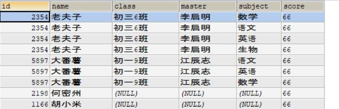

JDBC之Template(Spring)简化开发
	
	1.导入jar包
	2.创建JdbcTemplate对象，通过Druid工具类的getDataSource()获取连接池作为参数
	3.调用JdbcTemplate对象，执行sql语句，并处理相应的返回结果
	

1.导入jar包

	commons-logging-1.2.jar
	spring-beans-5.0.0.RELEASE.jar
	spring-core-5.0.0.RELEASE.jar
	spring-jdbc-5.0.0.RELEASE.jar
	spring-tx-5.0.0.RELEASE.jar
	mysql-connector-java-8.0.16.jar
	druid-1.0.13.jar     
		//因为创建JdbcTemplate对象需要： 
			DruidDataSourceFactory.createDataSource(properties)作为参数								

2.创建JdbcTemplate对象，通过Druid工具类的getDataSource()获取连接池作为参数

	/*
		Druid工具类的getDataSource()：
		通过Properties加载Classloader加载并转化过后的配置文件的流，
		将其作为参数，完成：
			DataSource dSource = DruidDataSourceFactory.createDataSource(properties);

	*/

	JdbcTemplate jdbcTemplate = new JdbcTemplate(MySqlDruid.getDataSource());
	
	static public DataSource getDataSource() {return dSource;}	

3.调用JdbcTemplate对象，执行sql语句，并处理相应的返回结果
	
	1.update:	可执行DML(增删改表中数据)，DDL(增删改表,数据库) //返回值为影响的行数
	2.queryForMap:	可执行DQL(查询表中数据)  // 返回map对象，键值对，单个结果
	3.queryForList：可执行DQL(查询表中数据)  // 返回包含若干map对象的list
	4.query: 可执行DQL(查询表中数据)  // 返回包含指定的类对象的list
	5.queryForObject : 可执行DQL的聚合函数 
		//返回单个结果的count(),max(),min(),avg(),sum()

1.update:	可执行DML(增删改表中数据)，DDL(增删改表,数据库) //返回值为影响的行数

	int	update(String sql, Object... args)

	举例：
		String sql = "insert into student (id,NAME,score) values (?,?,?) ";
		jdbcTemplate.update(sql, 222,"忙k孙",23)；
		
2.queryForMap:	可执行DQL(查询表中数据)  // 返回map对象，键值对，单个结果：key为主键

	Map<String,Object>	queryForMap(String sql, Object... args)

	举例：
		String sql = "select * from student where id = ? ";
		System.out.println(jdbcTemplate.queryForMap(sql, 72567));

3.queryForList：可执行DQL(查询表中数据)  // 返回包含若干map对象的list

	List<Map<String,Object>>	queryForList(String sql, Object... args)
	
	举例：
		String sql = "select * from student where id = ? ";
		System.out.println(jdbcTemplate.queryForList(sql, 2354));

4.query: 可执行DQL(查询表中数据)  // 返回包含指定的类对象的list

	<T> List<T>	query(String sql, RowMapper<T> rowMapper, Object... args)

	举例：
		String sql = "select * from student where id = ? ";
		List<Student> query = jdbcTemplate.query(sql,new BeanPropertyRowMapper<Student>(Student.class),2354);
		for(Student s:query) {
			System.out.println(s);
		}
		
	说明：指定的类要有与该表能配对上的 各种成员变量 以及 各自的get,set方法
		 
	
	Student类：
	class Student{
		private Integer id;
		private String name;
		private String className;
		private String master;
		private String subject;
		private int score;
		@Override
		public String toString() {
			return "Student [id=" + id + ", name=" + name + ", className=" + className + ", master=" + master + ", subject="
					+ subject + ", score=" + score + "]";
		}
		public Integer getId() {
			return id;
		}
		public void setId(Integer id) {
			this.id = id;
		}
		public String getName() {
			return name;
		}
		public void setName(String name) {
			this.name = name;
		}
		public String getClassName() {
			return className;
		}
		public void setClassName(String className) {
			this.className = className;
		}
		public String getMaster() {
			return master;
		}
		public void setMaster(String master) {
			this.master = master;
		}
		public String getSubject() {
			return subject;
		}
		public void setSubject(String subject) {
			this.subject = subject;
		}
		public int getScore() {
			return score;
		}
		public void setScore(Integer score) {
			this.score = score;
		}
			
	}
	

	
5.queryForObject : 可执行DQL的聚合函数 //返回单个结果的count(),max(),min(),avg(),sum()
	
	<T> T	queryForObject(String sql, Class<T> requiredType, Object... args)

	//The query is expected to be a single row/single column query; 
	//the returned result will be directly mapped to the corresponding object type.
	举例：
		
		String sql = "select count(id) from student where id = ?";
		System.out.println(jdbcTemplate.queryForObject(sql, int.class,2354));

