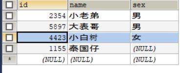

SQL之多表查询：内连接，外连接，子连接

先看表：(仅作为展示作用)
	
	
	
内连接：

	取的是表中的交集部分 -- 仅满足条件的多表中的数据

	隐式：select 字段列表 from 表1，表2，表3 where 条件

	    SELECT 
	    	t1.*,
	    	t2.*
	    FROM 	student t1,
	    		man t2
	    WHERE 	t1.id = t2.id;
    

	显式：select 字段列表 from 表1 join 表2 on 条件

    SELECT 
    	t1.*,
    	t2.*
    FROM 	student  t1
    JOIN	man  t2 
    ON	t1.id = t2.id;
	
内连接查询结果：
	
    

外连接：

	-- (左右)表的全部数据以及两表间的交集，但可以多个join实现多表间 
	的外连接。外连接分为：左外连接，右外连接。

	
	-- 左外连接：select 字段列表 from 左表 left join 右表1 on 条件1
									    left join 右表2 on 条件2
									    ....
	
    SELECT 
    	t1.*,
    	t2.*
    FROM 	student  t1
    LEFT JOIN 
    	man  t2 
    ON	t1.id = t2.id;

    SELECT 
    	t1.*,
    	t2.*
    FROM 	student  t1
    RIGHT JOIN 
    	man  t2 
    ON	t1.id = t2.id;

左外连接查询结果：
	
右外连接查询结果：
	

子连接：

	-- select 语句中嵌套 select 子语句，
	根据select子语句的返回结果，可以分为 
			单列单数据、单列多数据、多列多数据

	单列单数据，select 子语句作为条件部分，
				用关系运算符来处理（数值）
    SELECT 
    	t1.*,
    	t2.*
    FROM 	student  t1
    JOIN 
    	man  t2 
    ON	t1.id = t2.id AND t1.`score` < 
		(SELECT AVG(score) FROM student);

单列单数据查询结果：

	单列多数据，select 子语句作为条件部分，
				可用运算符in来处理(集合)

    SELECT 
    	t1.*,
    	t2.*
    FROM 	student  t1
    JOIN 
    	man  t2 
    ON	t1.id = t2.id 
	AND t1.id 
	IN (SELECT id FROM man WHERE NAME = "小老弟" 
		OR NAME = "大表哥");

单列多数据查询结果    

	多列多数据，select 子语句作为一张表，
				参与条件选择
    SELECT 
    	t1.*,
    	t2.*
    FROM 	student  t1
    JOIN 
    	(SELECT * FROM man WHERE NAME = "小老弟" 
		OR NAME = "大表哥") t2
    ON	t1.id = t2.id ;

多列多数据查询结果：

